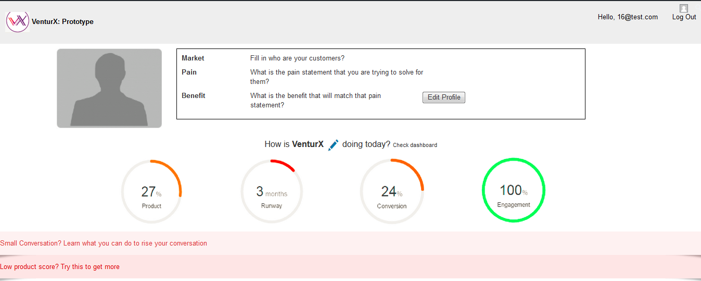

# **VenturX**

## **Summary of the project:**

This is the Project for interview challenge, written in PHP, HTML, CSS and WordPress.
The project uses WordPress widget to build dynamic module for content management. 

## **Requirement**

This program requires WordPress and WAMP

## **Features**
* use WordPress widget to manage website content dynamically

The user interface looks like below:

